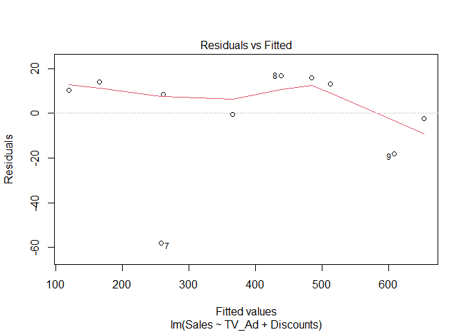
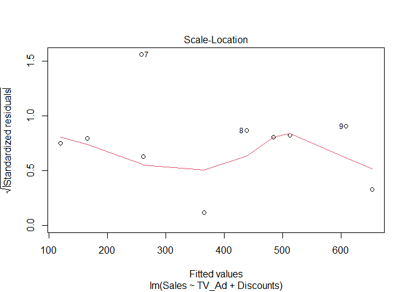
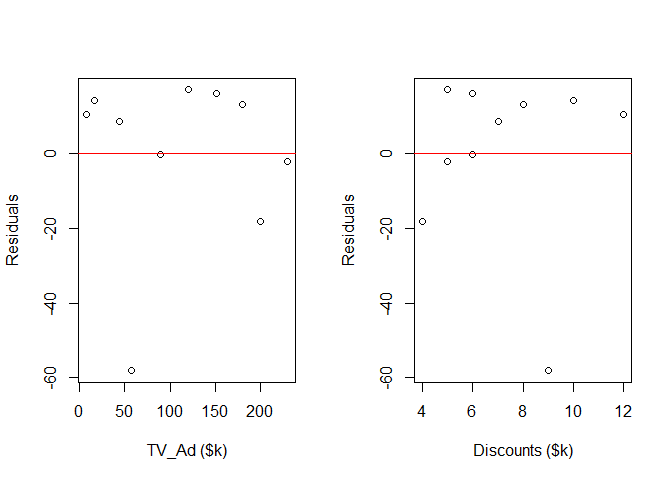
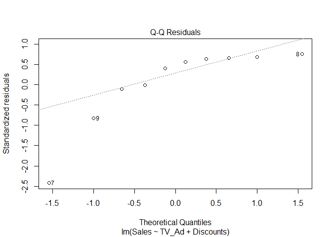
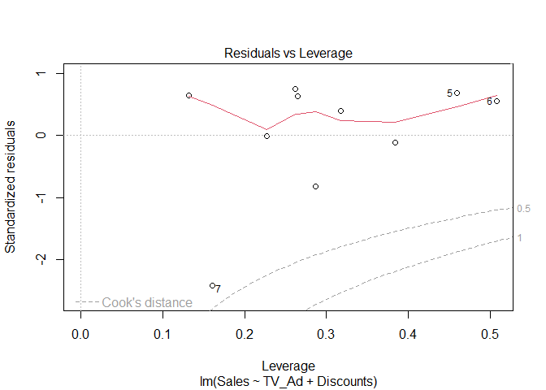
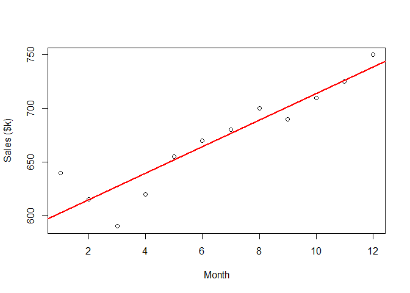
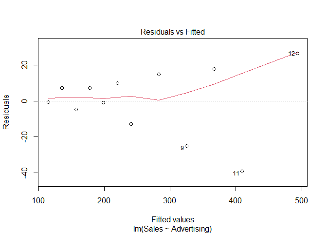
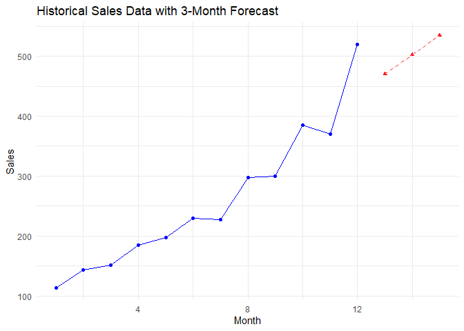
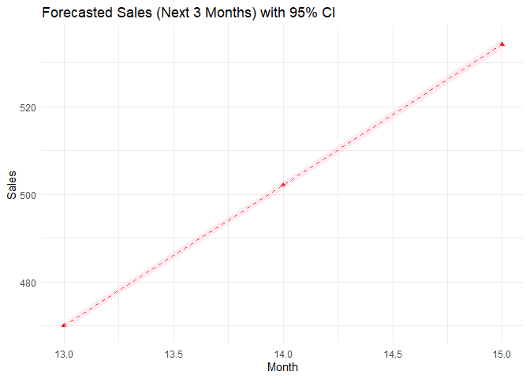

Formative Assessment 1
================
Baybayon, Darlyn Antoinette B.


``` r
suppressPackageStartupMessages({
  library(readr)
  library(tidyverse)
  library(car)
})
```

## I. Advertising and Sales

``` r
df1 <- data.frame(
  Store = 1:10,
  TV_Ad = c(230,44,17,151,180,8,57,120,200,90),
  Radio_Ad = c(37,39,45,41,10,36,35,50,33,45),
  Social_Media_Ad = c(22, 10, 12, 24, 15, 9, 10, 20, 18, 25),
  Discounts = c(5,7,10,6,8,12,9,5,4,6),
  Sales = c(650, 270, 180, 500, 525, 130, 200, 455, 590, 365)
)

df1
```

    ##    Store TV_Ad Radio_Ad Social_Media_Ad Discounts Sales
    ## 1      1   230       37              22         5   650
    ## 2      2    44       39              10         7   270
    ## 3      3    17       45              12        10   180
    ## 4      4   151       41              24         6   500
    ## 5      5   180       10              15         8   525
    ## 6      6     8       36               9        12   130
    ## 7      7    57       35              10         9   200
    ## 8      8   120       50              20         5   455
    ## 9      9   200       33              18         4   590
    ## 10    10    90       45              25         6   365

### Task 1.1

1.  Fit a full multiple regression model of sales with all other
    variables as predictors.
2.  Use stepwise selection (forward, backward, or both) to select the
    best subset of variables.
3.  Write the final regression equation.
4.  Interpret the coefficients of the selected variables
5.  Answer the following:
    - Which variables significantly affect Sales?
    - How does variable selection improve model parsimony?
    - Compare R2 and Adjusted R2 before and after selection.

``` r
df1_model <- lm(Sales ~ ., data =df1[-1])

summary(df1_model)
```

    ## 
    ## Call:
    ## lm(formula = Sales ~ ., data = df1[-1])
    ## 
    ## Residuals:
    ##       1       2       3       4       5       6       7       8       9      10 
    ##  -2.149  20.080  12.795   5.268  14.449   8.680 -51.606  17.234  -8.831 -15.921 
    ## 
    ## Coefficients:
    ##                 Estimate Std. Error t value Pr(>|t|)   
    ## (Intercept)     232.0168   133.9827   1.732  0.14388   
    ## TV_Ad             1.8930     0.3423   5.531  0.00265 **
    ## Radio_Ad         -0.1351     1.6142  -0.084  0.93657   
    ## Social_Media_Ad   2.2002     2.8445   0.773  0.47420   
    ## Discounts       -11.7317     8.5620  -1.370  0.22894   
    ## ---
    ## Signif. codes:  0 '***' 0.001 '**' 0.01 '*' 0.05 '.' 0.1 ' ' 1
    ## 
    ## Residual standard error: 28.9 on 5 degrees of freedom
    ## Multiple R-squared:  0.9863, Adjusted R-squared:  0.9753 
    ## F-statistic: 90.02 on 4 and 5 DF,  p-value: 7.607e-05

``` r
null_model <- lm(Sales ~ 1, data = df1[-1])

df1_model_selection <- step(null_model, direction = "both",
                               scope = formula(df1_model))
```

    ## Start:  AIC=105.25
    ## Sales ~ 1
    ## 
    ##                   Df Sum of Sq    RSS     AIC
    ## + TV_Ad            1    295190   9663  72.734
    ## + Discounts        1    213038  91814  95.249
    ## + Social_Media_Ad  1    157391 147462  99.987
    ## <none>                         304853 105.250
    ## + Radio_Ad         1     20149 284703 106.566
    ## 
    ## Step:  AIC=72.73
    ## Sales ~ TV_Ad
    ## 
    ##                   Df Sum of Sq    RSS     AIC
    ## + Discounts        1      4863   4799  67.736
    ## + Radio_Ad         1      3361   6301  70.459
    ## + Social_Media_Ad  1      3237   6426  70.656
    ## <none>                           9663  72.734
    ## - TV_Ad            1    295190 304853 105.250
    ## 
    ## Step:  AIC=67.74
    ## Sales ~ TV_Ad + Discounts
    ## 
    ##                   Df Sum of Sq   RSS    AIC
    ## <none>                          4799 67.736
    ## + Social_Media_Ad  1       618  4181 68.357
    ## + Radio_Ad         1       125  4675 69.473
    ## - Discounts        1      4863  9663 72.734
    ## - TV_Ad            1     87015 91814 95.249

``` r
# summary(df1_model_selection)
```

Using the step() function, a stepwise model selection in both directions
was performed to select the best subset of predictors. After iteratively
adding and removing variable, the resulting final model, Sales ~ TV_Ad +
Discounts, is chosen as it provides the lowest AIC value indicating
better fit among the models.

The final regression equation is given by:
$$\text{Sales} = \beta_0 ~+ ~\beta_1\cdot \text{TV_Ad} ~+ ~ \beta_2\cdot \text{Discounts} + \epsilon$$

``` r
df1_final_model <- lm(Sales ~ TV_Ad + Discounts, data = df1[-1])
(summary(df1_final_model))
```

    ## 
    ## Call:
    ## lm(formula = Sales ~ TV_Ad + Discounts, data = df1[-1])
    ## 
    ## Residuals:
    ##     Min      1Q  Median      3Q     Max 
    ## -58.109  -1.760   9.409  13.843  16.929 
    ## 
    ## Coefficients:
    ##             Estimate Std. Error t value Pr(>|t|)    
    ## (Intercept) 276.0688    55.2668   4.995  0.00157 ** 
    ## TV_Ad         1.9469     0.1728  11.266  9.7e-06 ***
    ## Discounts   -14.3261     5.3789  -2.663  0.03231 *  
    ## ---
    ## Signif. codes:  0 '***' 0.001 '**' 0.01 '*' 0.05 '.' 0.1 ' ' 1
    ## 
    ## Residual standard error: 26.18 on 7 degrees of freedom
    ## Multiple R-squared:  0.9843, Adjusted R-squared:  0.9798 
    ## F-statistic: 218.8 on 2 and 7 DF,  p-value: 4.896e-07

R2 comparison

``` r
data.frame(
  Model = c('Inital', 'Final'),
  R2 = c(summary(df1_model)$r.squared, summary(df1_final_model)$r.squared),
  Adj_R2 = c(summary(df1_model)$adj.r.squared, summary(df1_final_model)$adj.r.squared)
)
```

    ##    Model        R2    Adj_R2
    ## 1 Inital 0.9863047 0.9753484
    ## 2  Final 0.9842571 0.9797591

The final selected model predicts Sales based on TV_Ad and Discounts.
The model was statistically significant, F(2,7) = 218.8, p \< 0.001.
Both predictor variables were also statistically significant.

TV_Ad (b = 1.947): For every one-unit increase in spending on TV_Ad,
Sales are predicted to increase by 1.95 units, assuming other variables
are kept constant. The positive coefficient indicates a positive
relationship, meaning that more TV advertising translates to higher
sales.

Discount (b = -14.326): For every one-unit increase in Discounts, Sales
are predicted to decrease by 14.33 units, while holding other variables
constant. This negative relationship suggests that discounts may be
associated with declining sales, likely due to lower product value while
failing to attract enough additional buyers to compensate for the loss.

Both TV_Ad (p = 0.000) and Discounts (p = 0.032) have statistically
significant effect on Sales. Notably, the Discounts (b = -14.326)
variable has a larger effect size, in terms of magnitude. Its impact on
sales is over 7 times greater than that of the TV_Ad.

The selection improved model parsimony by choosing the simplest model
that fits the data well. It selected the best subset of variables while
retaining strong predictive power. From the initial model, Radio_Ad and
Social_Media_Ad have high p-values and their coefficients are very close
to zero, indicating lack of statistical significance and minimal effect
on Sales.

The initial full model had an R2 of 0.986, indicating that 98.6% of the
variability in Sales is explained by the model. It went down slightly in
the final model to an R2 of 0.984, suggesting a minimal decrease in
explained variance. This minor drop indicates that the removed variables
contribute little to the model’s overall predictive power. However, in
the Adjusted R2, we see some increase from the full model to the final
model, indicating an improvement in model performance after accounting
for the number of predictors. This explains the final model is more
parsimonious, demonstrating good predictive power while using fewer,
more significant variables.

### Task 1.2:

1.  Check linearity, homoscedasticity, normality of residuals, and
    independence.

2.  Plot residuals vs. fitted values, Q-Q plot, and leverage plots.

3.  Identify any outliers or influential points.

4.  Answer the following:

    - Are the assumptions of multiple regression satisfied?

    - What remedial measures can be applied if assumptions are violated?

Residuals vs Fitted plot

``` r
# linearity 
plot(df1_final_model, 1)
```

<!-- -->

The residuals vs fitted plot may be used to assess linearity and
independence of errors. There is no strong curvature in the plot,
suggesting linearity in the relationship and indicates no underlying
relationship among the residuals. However, we can observe one point
being scattered very far apart from the others. This point may be
influential and is affecting the fit of the model.

``` r
# homoscedasticity
plot(df1_final_model, 3)
```

<!-- -->

The Scale-Location plot standardizes the residuals and plots them
against the fitted values. No significant patterns can be observed in
the plot suggesting constant variance along the regression line. One
observation stands out again as an outlier from the rest of the points.

Residuals vs Predictors plots

``` r
par(mfrow=c(1,2))
plot(df1$TV_Ad, resid(df1_final_model),xlab = "TV_Ad ($k)", ylab = "Residuals")
abline(h = 0, col = "red")
plot(df1$Discounts, resid(df1_final_model),xlab = "Discounts ($k)", ylab = "Residuals")
abline(h = 0, col = "red")
```

<!-- -->

Normal Q-Q plot

``` r
# normality
plot(df1_final_model,2)
```

<!-- -->

The Q-Q Residuals plot is used to check for the normality of the
residuals. In this plot, while most points lie close to the reference
line, we find some problematic observations deviating significantly in
the lower end of the plot. This may be an indication of a violation in
the normality distribution.

Residuals vs Leverage plot

``` r
# influential
# par(mfrow=c(1,2))
plot(df1_final_model,5)
```

<!-- -->

The Residuals vs. Leverage plot shows the magnitude of the residuals as
well as their leverage or influence. Point no. 7 is a large residual but
low leverage, meaning that it has only a small effect on the resulting
model. Points 5 and 6 have high leverage but small residuals resulting
to minimal impact on the model. No points cross the Cook’s distance
threshold indicating that no point is influential or problematic enough
to significantly affect the regression model.

The model passed the assumptions of linearity, homoscedasticity, and
independence. On the other hand, the normality assumption is violated.
Although the point did not have sighnificant leverage, we may consider
removing it and refitting the model.

## II. Monthly Sales and Advertising

``` r
df2 <- data.frame(
  Month = 1:12,
  TV_Ad = c(210, 200, 195, 210, 220, 225, 230, 240, 235, 245, 250, 260),
  Sales = c(640, 615, 590, 620, 655, 670, 680, 700, 690, 710, 725, 750)
)

df2
```

    ##    Month TV_Ad Sales
    ## 1      1   210   640
    ## 2      2   200   615
    ## 3      3   195   590
    ## 4      4   210   620
    ## 5      5   220   655
    ## 6      6   225   670
    ## 7      7   230   680
    ## 8      8   240   700
    ## 9      9   235   690
    ## 10    10   245   710
    ## 11    11   250   725
    ## 12    12   260   750

### Task 2.1

1.  Fit a time series regression model: Sales as a function of TV_Ad and
    time trend.

2.  Plot Sales vs time with regression line.

3.  Compute Durbin-Watson statistic for autocorrelation of residuals.

4.  Answer the following:

    - Is there evidence of autocorrelation in the residuals?

    - What does the Durbin-Watson value indicate about model validity?

``` r
df2_model <- lm(Sales ~ Month, data = df2)
summary(df2_model)
```

    ## 
    ## Call:
    ## lm(formula = Sales ~ Month, data = df2)
    ## 
    ## Residuals:
    ##     Min      1Q  Median      3Q     Max 
    ## -37.156  -5.587   1.664   7.083  37.564 
    ## 
    ## Coefficients:
    ##             Estimate Std. Error t value Pr(>|t|)    
    ## (Intercept)  590.076     11.720  50.347 2.31e-13 ***
    ## Month         12.360      1.592   7.762 1.53e-05 ***
    ## ---
    ## Signif. codes:  0 '***' 0.001 '**' 0.01 '*' 0.05 '.' 0.1 ' ' 1
    ## 
    ## Residual standard error: 19.04 on 10 degrees of freedom
    ## Multiple R-squared:  0.8576, Adjusted R-squared:  0.8434 
    ## F-statistic: 60.24 on 1 and 10 DF,  p-value: 1.533e-05

``` r
plot(df2$Month, df2$Sales, xlab= "Month", ylab="Sales ($k)")
abline(df2_model, col = "red", lwd = 2)
```

<!-- -->

Durbin-Watson Test

``` r
durbinWatsonTest(df2_model)
```

    ##  lag Autocorrelation D-W Statistic p-value
    ##    1       0.1786614      1.216443   0.036
    ##  Alternative hypothesis: rho != 0

A Durbin-Watson test was performed on the regression model to determine
if there is autocorrelation between the residuals. The null hypothesis
is that there is no correlation. The test statistic is DW = 1.216 with p
= 0.07. For n = 12 and k =1, and the critical bounds at alpha = 0.05 are
dL =0.971 and dU = 1.331. The DW statistic is less than 2 which may
suggest positive autocorrelation. However, since dL \< DW \< dU and p \>
0.05, the test is inconclusive and we fail to reject the null
hypothesis. We conclude that the residuals are not correlated. This
suggests that the model’s residuals are uncorrelated, and the
predictions are likely reliable and does not miss any underlying
patterns in the data.

### Task 2.2

1.  If autocorrelation exists, apply the Cochrane-Orcutt method to
    correct it.

2.  Refit the regression model and compare coefficients, R², and
    residual plots before and after correction.

3.  Answer the following:

    - How did the Cochrane-Orcutt method affect your model?

    - Explain the importance of correcting autocorrelation.

Since autocorrelation is not present in the model, no correction is
needed. Correcting autocorrection is important because it can affect the
reliability pf the model, making faux correlati.

## III. Sales with Heteroscedasticity

``` r
df3 <- data.frame(
  Month = 1:12,
  Advertising = c(30, 35, 40, 45, 50, 55, 60, 70, 80, 90, 100, 120),
  Sales = c(114, 143, 152, 185, 198, 230, 228, 298, 300, 385, 370, 520)
)
df3
```

    ##    Month Advertising Sales
    ## 1      1          30   114
    ## 2      2          35   143
    ## 3      3          40   152
    ## 4      4          45   185
    ## 5      5          50   198
    ## 6      6          55   230
    ## 7      7          60   228
    ## 8      8          70   298
    ## 9      9          80   300
    ## 10    10          90   385
    ## 11    11         100   370
    ## 12    12         120   520

### Task 3.1

1.  Fit a simple regression: Sales ~ Advertising.
2.  Plot residuals vs fitted values.
3.  Conduct a test for heteroscedasticity.
4.  Answer the following:
    - Is heteroscedasticity present?
    - How does it affect standard errors and hypothesis tests?

``` r
df3_model <- lm(Sales ~ Advertising, data= df3)
summary(df3_model)
```

    ## 
    ## Call:
    ## lm(formula = Sales ~ Advertising, data = df3)
    ## 
    ## Residuals:
    ##     Min      1Q  Median      3Q     Max 
    ## -39.246  -6.864   3.188  11.291  26.614 
    ## 
    ## Coefficients:
    ##             Estimate Std. Error t value Pr(>|t|)    
    ## (Intercept) -11.4494    14.7131  -0.778    0.454    
    ## Advertising   4.2070     0.2104  19.994 2.15e-09 ***
    ## ---
    ## Signif. codes:  0 '***' 0.001 '**' 0.01 '*' 0.05 '.' 0.1 ' ' 1
    ## 
    ## Residual standard error: 19.54 on 10 degrees of freedom
    ## Multiple R-squared:  0.9756, Adjusted R-squared:  0.9732 
    ## F-statistic: 399.8 on 1 and 10 DF,  p-value: 2.152e-09

A simple linear regression model was fitted using Sales as outcome and
Advertising as predictor. The model was statistically significant,
F(1,10) = 3998, p \< 0.05. Advertising (b = 4.207, p \<0.05) was found
to be a significant predictor, suggesting that for each one-unit
increase in Advertising, Sales increase by approximately 4.21 units, on
average.

``` r
plot(df3_model, 1)
```

<!-- -->

In the Residuals vs. Fitted plot, the points fan out towards the right,
which indicates that the variability of the residuals is changing.
Specifically, the errors are increasing for larger predicted outcomes.
This plot demonstrates a violation in the assumption of
homoscedasticity.

``` r
lmtest::bptest(df3_model)
```

    ## 
    ##  studentized Breusch-Pagan test
    ## 
    ## data:  df3_model
    ## BP = 7.1969, df = 1, p-value = 0.007303

A Breusch-Pagan test was conducted to check if the variance of the
residuals is constant. This test assumes the null hypothesis that
homoscedasticity is present. The test yield a p-value of 0.002 which is
less than the significance level 0.05. Therefore, we have significant
evidence to reject the null hypothesis and conclude that
heteroscedasticity is present, supporting our findings from the
Residuals vs. fitted plot.

Homoscedasticity is a crucial assumption in linear regression. With the
presence of heteroscedasticity, the residuals do not have a constant
variance, which may suggest that there is an underlying relationship not
fully captured by the model. As a result, it compromises the reliability
of the model, leading to inaccurate standard errors or misleading
p-values.

### Task 3.2

1.  Apply WLS regression to correct for heteroscedasticity.
2.  Compare coefficients, standard errors, and model fit before and
    after WLS.
3.  Answer the following:
    - How does WLS improve the model?
    - Why is weighting necessary in heteroscedastic data?

``` r
wt <- 1/ lm(abs(df3_model$residuals) ~ df3_model$fitted.values)$fitted.values^2

df3_wls_model <- lm(Sales ~ Advertising, data = df3, weights =wt)
summary(df3_wls_model)
```

    ## 
    ## Call:
    ## lm(formula = Sales ~ Advertising, data = df3, weights = wt)
    ## 
    ## Weighted Residuals:
    ##     Min      1Q  Median      3Q     Max 
    ## -1.5542 -1.0888  0.2370  0.8496  2.0689 
    ## 
    ## Coefficients:
    ##             Estimate Std. Error t value Pr(>|t|)    
    ## (Intercept) -12.0404     5.8751  -2.049   0.0676 .  
    ## Advertising   4.2366     0.1687  25.115 2.29e-10 ***
    ## ---
    ## Signif. codes:  0 '***' 0.001 '**' 0.01 '*' 0.05 '.' 0.1 ' ' 1
    ## 
    ## Residual standard error: 1.22 on 10 degrees of freedom
    ## Multiple R-squared:  0.9844, Adjusted R-squared:  0.9828 
    ## F-statistic: 630.8 on 1 and 10 DF,  p-value: 2.293e-10

A simple weighted linear regression model was fitted using Sales as the
outcome and Advertising as the predictor, accounting for
heteroscedasticity by applying weights. The model was statistically
significant (F(1,10) = 630.8, p\< 0.05). Advertising (b = 4.237, p
\<0.05) was a significant predictor, suggesting that for each one-unit
increase in Advertising, Sales increase by approximately 4.24 on
average, after adjusting for heteroscedasticity.

The coefficients in this weighted model did not change significantly,
only slightly smaller. The model showed improved precision with a much
lower residual standard error of 1.22 compared to the ordinary least
squares model’s 19.54. It’s Adj. R2 has also improved slightly, from
0.973 to 0.9828, indicating better fit.

### Task 3.3

1.  Using the final time series model (with or without Cochrane-Orcutt
    correction), forecast Sales for the next 3 months.
2.  Compute 95% prediction intervals
3.  Plot historical Sales, forecasted values, and prediction intervals.
4.  Answer the following:
    - How reliable are your forecasts?

``` r
ad_model <- lm(Advertising ~ Month, data = df3)

future_time <- data.frame(Month = 13:15)
forecast_ad <- predict(ad_model, newdata = future_time)

print(forecast_ad)
```

    ##        1        2        3 
    ## 113.7879 121.3578 128.9277

Predict using new Advertising data with 95% confidence interval

``` r
sales_forecast <- predict(df3_wls_model, 
        newdata = data.frame(Advertising = forecast_ad), 
        interval= "prediction",level = 0.05)
```

    ## Warning in predict.lm(df3_wls_model, newdata = data.frame(Advertising = forecast_ad), : Assuming constant prediction variance even though model fit is weighted

``` r
print(sales_forecast)
```

    ##        fit      lwr      upr
    ## 1 470.0323 469.1546 470.9101
    ## 2 502.1030 501.1439 503.0621
    ## 3 534.1737 533.1332 535.2143

``` r
forecast_df <- data.frame(
  Month = 13:15,
  Sales = sales_forecast[,"fit"],
  LB = sales_forecast[,"lwr"],
  UB = sales_forecast[,"upr"]
)
```

``` r
ggplot() +
  geom_line(data =df3, aes(x = Month, y = Sales), color = "blue") +
  geom_point(data =df3, aes(x = Month, y = Sales), color = "blue") +
  geom_line(data =forecast_df, aes(x = Month, y = Sales), color = "red", linetype = "dashed") +
  geom_point(data =forecast_df, aes(x = Month, y = Sales), color = "red", shape = 17) +
  geom_ribbon(data = forecast_df, aes(x = Month, ymin = LB, ymax = UB), fill = "pink", alpha = 0.3) +

  labs(title = "Historical Sales Data with 3-Month Forecast") +
  theme_minimal()
```

<!-- -->

``` r
library(ggplot2)

ggplot(forecast_df, aes(x = Month, y = Sales)) +
  geom_line(color = "red", linetype = "dashed") +
  geom_point(color = "red", shape = 17) +
  geom_ribbon(aes(ymin = LB, ymax = UB), fill = "pink", alpha = 0.3) +
  labs(title = "Forecasted Sales (Next 3 Months) with 95% CI") +
  theme_minimal()
```

<!-- -->
