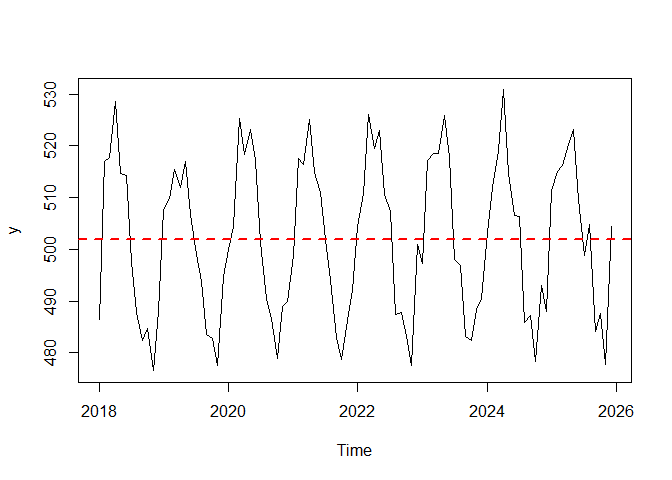
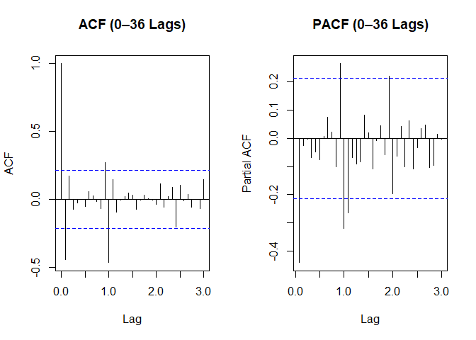
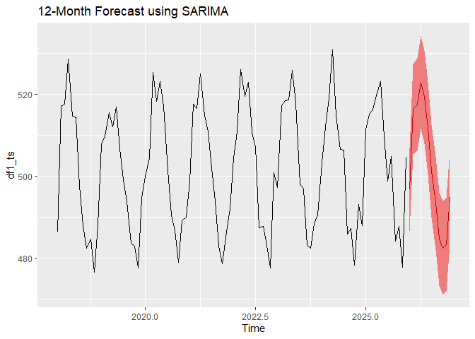

ARIMA/SARIMA Models
================
Baybayon, Darlyn Antoinette B.


``` r
suppressPackageStartupMessages({
  library(readxl)
  library(tidyverse)
  library(ggplot2)
  library(car)
  library(forecast)
  library(tseries)
})
```

## Dataset 1

``` r
df1 <- read_csv("~/FEU/5TH YR 1ST SEM/APM1215/FA3/data/dataset1.csv", show_col_types = FALSE)
head(df1)
```

    ## # A tibble: 6 × 2
    ##   month          y
    ##   <date>     <dbl>
    ## 1 2018-01-31  486.
    ## 2 2018-02-28  517.
    ## 3 2018-03-31  518.
    ## 4 2018-04-30  529.
    ## 5 2018-05-31  515.
    ## 6 2018-06-30  514.

### Time Series Plot

``` r
df1$month <- as.Date(paste0(df1$month, "-01"))
df1_ts <- ts(df1$y, start = c(2018, 1), frequency = 12)
plot(df1_ts, ylab = "y")
abline(h = mean(df1_ts), col = "red", lwd = 2, lty = 2)
```

<!-- -->

``` r
plot(stl(df1_ts, "periodic"))
```

<!-- -->

``` r
adf.test(df1_ts)
```

    ## Warning in adf.test(df1_ts): p-value smaller than printed p-value

    ## 
    ##  Augmented Dickey-Fuller Test
    ## 
    ## data:  df1_ts
    ## Dickey-Fuller = -12.879, Lag order = 4, p-value = 0.01
    ## alternative hypothesis: stationary

The time series plot shows a weak trend with very gradual movement
upwards and some fluctuations from 2018 through 2025. There is a
consistent additive seasonality, with peaks and troughs occurring at
regular intervals with constant amplitude. Peaks typically occur at
around the 1st quarter of the year and the troughs at around the
beginning of the 4th quarter per year. Some short runs are present,
indicating some autocorrelation in the series. The variance appears to
be constant through time. The Augmented Dickey-Fuller test confirms that
the series is stationary and hence does not need differencing before
applying ARIMA models.

### Sample ACF and PACF

``` r
par(mfrow =c(1,2))
acf(df1_ts, lag.max = 36, main = "ACF (0–36 Lags)")
pacf(df1_ts, lag.max = 36, main = "PACF (0–36 Lags)")
```

<!-- -->

The ACF does not cut off immediately and the plot show some seasonal
spikes at lags 1, 6, 12, 18, … while the PACF plot shows a cut off after
lag 1, suggesting MA(1).

``` r
sdiff1 <- diff(df1_ts, lag = 12)
par(mfrow=c(1,2))
acf(sdiff1, lag.max = 36, main = "ACF (0–36 Lags)")
pacf(sdiff1, lag.max = 36, main = "PACF (0–36 Lags)")
```

<!-- -->

After seasonality differencing, the ACF and PACF now cuts off after lag
1 which points to the need for AR(1) and MA(1).

### Model Fitting

Based on the characteristics of the series, the following SARIMA models
are proposed:

**SARIMA(1, 0, 1)(0, 1, 1)\[12\]** This includes both AR(1) and MA(1)
terms to capture the short-term correlations, seasonal differencing and
seasonal SMA(1) to model the yearly seasonality. Since the series is
already stationary but has strong seasonality, only seasonal
differencing is applied.

**SARIMA(1, 0, 0)(0, 1, 1)\[12\]** This is a simpler model only
including AR(1) for the non-seasonal part. This tests whether the MA(1)
component is necessary, assuming that past shocks do not significantly
affect current value. Similar seasonal terms will be used from the first
model, seasonal differencing is also applied.

``` r
df1.model1 <- Arima(df1_ts, order = c(1, 0, 1), seasonal = c(0, 1, 1))
df1.model2 <- Arima(df1_ts, order = c(1, 0, 0), seasonal = c(0, 1, 1))
```

### Model Summary

**SARIMA(1, 0, 1)(0, 1, 1)\[12\]**

``` r
summary(df1.model1)
```

    ## Series: df1_ts 
    ## ARIMA(1,0,1)(0,1,1)[12] 
    ## 
    ## Coefficients:
    ##           ar1     ma1     sma1
    ##       -0.5640  0.1435  -0.8450
    ## s.e.   0.2022  0.2303   0.1998
    ## 
    ## sigma^2 = 26.34:  log likelihood = -262.2
    ## AIC=532.39   AICc=532.9   BIC=542.11
    ## 
    ## Training set error measures:
    ##                    ME     RMSE      MAE       MPE      MAPE      MASE
    ## Training set 1.571563 4.714157 3.541584 0.3093021 0.7021224 0.5432305
    ##                    ACF1
    ## Training set -0.0440363

The AR(1) coefficient is moderately negative (-0.56), suggesting a
tendency for the series to oscillate around its mean, where a high value
in one period tends to be followed by a somewhat lower value in the
next. The MA(1) coefficient is small and statistically insignificant,
implying that the short-term noise have little consistent effect on
subsequent observations. The strong negative seasonal MA(1) (-0.845)
reflects the series’ consistent seasonal pattern, effectively capturing
the seasonal autocorrelation. Despite including the MA(1) term, the
model’s fit does not substantially improve over the simpler alternative,
and the relatively large standard error of the MA(1) coefficient raises
questions about its necessity. Overall, while the model fits the data
well, the non-seasonal MA(1) may not be necessary.

**SARIMA(1, 0, 0)(0, 1, 1)\[12\]**

``` r
summary(df1.model2)
```

    ## Series: df1_ts 
    ## ARIMA(1,0,0)(0,1,1)[12] 
    ## 
    ## Coefficients:
    ##           ar1     sma1
    ##       -0.4468  -0.8275
    ## s.e.   0.1097   0.1810
    ## 
    ## sigma^2 = 26.44:  log likelihood = -262.4
    ## AIC=530.79   AICc=531.09   BIC=538.09
    ## 
    ## Training set error measures:
    ##                    ME     RMSE      MAE       MPE      MAPE      MASE
    ## Training set 1.632637 4.751855 3.536208 0.3214387 0.7009542 0.5424058
    ##                     ACF1
    ## Training set -0.01981189

The AR(1) coefficient (-0.45) still indicates a moderate negative
autocorrelation in the short term.. The seasonal MA(1) coefficient
remains strongly negative (-0.83), effectively modeling the annual
seasonal shocks. Despite the reduced terms, this model achieves a
slightly better AIC and BIC, indicating better parsimony compared to the
first model. The lack of a non-seasonal MA(1) term does not degrade the
model’s performance, indicating that the short-term noise component is
minimal or sufficiently captured by the AR(1) term alone. This model’s
parsimony and comparable predictive accuracy with the first model make
it a preferable choice.

### Residual Diagnostics

**SARIMA(1, 0, 1)(0, 1, 1)\[12\]**

``` r
checkresiduals(df1.model1)
```

<!-- -->

    ## 
    ##  Ljung-Box test
    ## 
    ## data:  Residuals from ARIMA(1,0,1)(0,1,1)[12]
    ## Q* = 14.124, df = 16, p-value = 0.5895
    ## 
    ## Model df: 3.   Total lags used: 19

Residuals are randomly scattered around 0, indicating good fit of the
model. The Ljung-Box Test resulted in p \>0.05, hence we fail to reject
the null hypothesis of no autocorrelation. The residuals are independent
and identically distributed. The ACF plot shows one spike at lag 12,
which may indicate some leftover seasonal patterns even after
differencing. The residuals are approximately normally distributed as
shown in the histogram.

**SARIMA(1, 0, 0)(0, 1, 1)\[12\]**

``` r
checkresiduals(df1.model2)
```

<!-- -->

    ## 
    ##  Ljung-Box test
    ## 
    ## data:  Residuals from ARIMA(1,0,0)(0,1,1)[12]
    ## Q* = 14.281, df = 17, p-value = 0.6471
    ## 
    ## Model df: 2.   Total lags used: 19

Residuals are randomly scattered around 0, indicating good fit of the
model. The Ljung-Box Test resulted in p \>0.05, hence we fail to reject
the null hypothesis of no autocorrelation. The residuals are independent
and identically distributed. The ACF plot also shows one spike at lag
12, which may indicate some leftover seasonal patterns even after
differencing. The residuals are approximately normally distributed as
shown in the histogram.

### Forecast

**SARIMA(1, 0, 1)(0, 1, 1)\[12\]**

``` r
df1.fc1 <- forecast(df1.model1, h=12, level = 95)
autoplot(df1.fc1, main = "12-Month Forecast using SARIMA", fcol = "red")
```

<!-- -->

``` r
print(df1.fc1)
```

    ##          Point Forecast    Lo 95    Hi 95
    ## Jan 2026       496.6373 486.4656 506.8090
    ## Feb 2026       516.2872 505.2603 527.3141
    ## Mar 2026       517.4900 506.2047 528.7754
    ## Apr 2026       522.8679 511.5016 534.2342
    ## May 2026       519.2455 507.8536 530.6374
    ## Jun 2026       511.7740 500.3740 523.1741
    ## Jul 2026       501.2194 489.8167 512.6220
    ## Aug 2026       493.4974 482.0940 504.9009
    ## Sep 2026       484.6625 473.2589 496.0660
    ## Oct 2026       482.4738 471.0707 493.8769
    ## Nov 2026       483.2207 471.8191 494.6223
    ## Dec 2026       494.7392 483.3424 506.1359

``` r
data.frame(Avg = mean(df1.fc1$mean),LB = mean(df1.fc1$lower),UB = mean(df1.fc1$upper))
```

    ##        Avg       LB      UB
    ## 1 502.0096 490.7551 513.264

The forecast for the next 12 months is as shown above. The plot shows
the persistence of the seasonality, even 12 months later. The model
predicts an average y value of 502.01, thus continuing the slight upward
trend, with a 95% confidence interval of \[490.7551, 513.264\]. Thus, we
are 95% sure that in the next 12 months, the average y value will fall
within this interval.

**SARIMA(1, 0, 0)(0, 1, 1)\[12\]**

``` r
df1.fc2 <- forecast(df1.model2, h=12, level = 95)
autoplot(df1.fc2, main = "12-Month Forecast using SARIMA", fcol = "red")
```

<!-- -->

``` r
print(df1.fc2)
```

    ##          Point Forecast    Lo 95    Hi 95
    ## Jan 2026       496.9455 486.7801 507.1109
    ## Feb 2026       515.6540 504.5273 526.7806
    ## Mar 2026       518.1202 506.8115 529.4290
    ## Apr 2026       522.4222 511.0775 533.7670
    ## May 2026       519.6573 508.3054 531.0092
    ## Jun 2026       511.4916 500.1382 522.8450
    ## Jul 2026       501.3977 490.0441 512.7514
    ## Aug 2026       493.5325 482.1788 504.8862
    ## Sep 2026       484.7830 473.4293 496.1366
    ## Oct 2026       482.4221 471.0686 493.7756
    ## Nov 2026       483.3703 472.0177 494.7228
    ## Dec 2026       494.8286 483.4807 506.1765

``` r
data.frame(Avg = mean(df1.fc2$mean),LB = mean(df1.fc2$lower),UB = mean(df1.fc2$upper))
```

    ##        Avg       LB       UB
    ## 1 502.0521 490.8216 513.2826

``` r
mean(df1_ts)
```

    ## [1] 501.9917

The forecast for the next 12 months is as shown above. The plot shows
the persistence of the seasonality, even 12 months later. The model
predicts an average y value of 502.05, continuing on a slow upward
trend, with a 95% confidence interval of \[490.8216, 513.2825\]. Thus,
we are 95% sure that in the next 12 months, the average y value will
fall within this interval.

### Backtest

Split the dataset, the last 20% will be used for validation.

``` r
set.seed(123)
n <- length(df1_ts)
n_train <- floor(0.8 * n)
n_test <- n - n_train

df1_train <- window(df1_ts, end = c(2018 + (n_train - 1)/12))
df1_test <- window(df1_ts, start = c(2018 + (n_train)/12))
```

Fit models on training set

``` r
df1.model1.test <- Arima(df1_train, order = c(1, 0, 1), seasonal = c(0, 1, 1))
df1.model2.test <- Arima(df1_train, order = c(1, 0, 0), seasonal = c(0, 1, 1))
```

Forecast

``` r
df1.fc1.test <- forecast(df1.model1.test, h= n_test)
df1.fc2.test <- forecast(df1.model2.test, h= n_test)
```

Compare forecast accuracy on test set

**SARIMA(1, 0, 1)(0, 1, 1)\[12\]**

``` r
accuracy(df1.fc1.test, df1_test)[, c("MAPE", "MAE", "RMSE")]
```

    ##                   MAPE      MAE     RMSE
    ## Training set 0.5946344 3.005173 4.115515
    ## Test set     1.0905613 5.457210 6.574560

**MAPE = 1.09**: This indicates that, on average, the forecasts deviate
from the actual values by 1.09% demonstrating a very high level of
accuracy relative to the scale of the data.

**MAE/MAD = 5.46**: The MAD suggests that, on average, the forecasts
differ from the observed values by approximately 5.46 units, providing a
straightforward measure of average prediction error in the original
units.

**RMSE = 6.57**: The MSD also quantifies the difference of forecast from
actual values but greatly penalizes larger errors. On average, the
difference between the forecast and actual value is about 6.57, which is
only slightly higher than MAD, suggesting that the larger residuals are
not far off from others.

**SARIMA(1, 0, 0)(0, 1, 1)\[12\]**

``` r
accuracy(df1.fc2.test, df1_test)[, c("MAPE", "MAE", "RMSE")]
```

    ##                   MAPE      MAE     RMSE
    ## Training set 0.6042305 3.055969 4.260739
    ## Test set     1.0707886 5.358534 6.464281

**MAPE = 1.07**: This indicates that, on average, the forecasts deviate
from the actual values by 1.07% demonstrating a very high level of
accuracy relative to the scale of the data.

**MAE/MAD = 5.36**: The MAD suggests that, on average, the forecasts
differ from the observed values by approximately 5.36 units, providing a
straightforward measure of average prediction error in the original
units.

**RMSE = 6.46**: The MSD also quantifies the difference of forecast from
actual values but greatly penalizes larger errors. On average, the
difference between the forecast and actual value is about 6.46, which is
only slightly higher than MAD, suggesting that the larger residuals are
not far off from others.

Based on the accuracy measures on test data, the second SARIMA model
outperforms the first.

### Conclusion

The SARIMA(1,0,0)(0,1,1)\[12\] model was selected as the final model for
its simplicity and slightly better forecast accuracy. Compared to the
more complex alternative with MA(1), this model achieved lower AIC/BIC
and slightly better forecast accuracy (MAPE, MAE, and RMSE) in
backtesting, without compromising model adequacy.

The AR(1) term (-0.45) captures short-term negative autocorrelation,
while the strong SMA(1) term (-0.83) models the annual repeating changes
in the series. Diagnostic checks confirm the model is stationary, no
autocorrelation, and that residuals behave like white noise, indicating
a good fit. However, a limitation remains, as minor spike at lag 12 in
the residual ACF was found. This suggests that some seasonal effects
were not fully captured, leaving some structure in the residuals.
Overall, the model reliably captures the series’ dynamics and
seasonality, and provides reliable short-term forecasts.

## Dataset 2

``` r
df2 <- read_csv("~/FEU/5TH YR 1ST SEM/APM1215/FA3/data/dataset2.csv", show_col_types = FALSE)
head(df2)
```

    ## # A tibble: 6 × 1
    ##       y
    ##   <dbl>
    ## 1  4.58
    ## 2  5.22
    ## 3  6.07
    ## 4  9.21
    ## 5 12.6 
    ## 6 14.3

### Time Series Plot

``` r
df2_ts <- ts(df2$y)
plot(df2_ts, ylab = "y")
abline(h = mean(df2_ts), col = "red", lwd = 2, lty = 2)
```

<!-- -->

``` r
adf.test(df2_ts)
```

    ## Warning in adf.test(df2_ts): p-value smaller than printed p-value

    ## 
    ##  Augmented Dickey-Fuller Test
    ## 
    ## data:  df2_ts
    ## Dickey-Fuller = -4.8114, Lag order = 6, p-value = 0.01
    ## alternative hypothesis: stationary

The time series plot shows a trend which grows initially but tends to
oscillate eventually around 25. There are no strong recurring peaks and
troughs in the series indicating no strong seasonality. The variance
does not appear to grow or shrink drastically over time, and is likely
constant. The Augmented Dickey-Fuller test confirms that the series is
stationary (p\<0.05), so no differencing will be needed.

### Sample ACF and PACF

``` r
par(mfrow =c(1,2))
acf(df2_ts, lag.max = 36, main = "ACF (0–36 Lags)")
pacf(df2_ts, lag.max = 36, main = "PACF (0–36 Lags)")
```

<!-- -->

The ACF does not cut off immediately and we see gradual decay while the
PACF plot shows a cut off after lag 2. These point to the presence of AR
component and need of AR(2).

### Model Fitting

Based on the characteristics of the series, the following ARIMA models
are proposed:

**ARIMA(2, 0, 0)**

This model includes two autoregressive (AR(2)) terms and no differencing
or moving average terms since the ACF does not cut off. No differencing
applied since series is already stationary.

**ARIMA(2, 0, 1)**

This model includes two autoregressive terms for lag 1 and 2 (AR(2)) and
one moving average term MA(1) to capture short-term dependencies and
shock effects in a non-seasonal time series. No differencing applied
since series is already stationary.

``` r
df2.model1 <- Arima(df2_ts, order = c(2, 0, 0))
df2.model2 <- Arima(df2_ts, order = c(2, 0, 1))
```

### Model Summary

**ARIMA(2, 0, 0)**

``` r
summary(df2.model1)
```

    ## Series: df2_ts 
    ## ARIMA(2,0,0) with non-zero mean 
    ## 
    ## Coefficients:
    ##          ar1      ar2     mean
    ##       1.2425  -0.2567  21.7586
    ## s.e.  0.0616   0.0636   3.9127
    ## 
    ## sigma^2 = 0.8964:  log likelihood = -341.52
    ## AIC=691.04   AICc=691.21   BIC=705.13
    ## 
    ## Training set error measures:
    ##                      ME      RMSE      MAE       MPE     MAPE      MASE
    ## Training set 0.09033082 0.9410936 0.750966 0.3314581 3.404778 0.9747038
    ##                     ACF1
    ## Training set -0.01344539

The AR(1) coefficient is positive (1.24), while the AR(2) coefficient is
negative (-0.26). These values indicate that the series tend to continue
towards the same direction short-term but may reverse over the next step
(due to AR(2)). This behavior is as shown in the oscillations in the
time series plot. The standard errors of both AR coefficients are small,
indicating their statistical significance.

**ARIMA(2, 0, 1)**

``` r
summary(df2.model2)
```

    ## Series: df2_ts 
    ## ARIMA(2,0,1) with non-zero mean 
    ## 
    ## Coefficients:
    ##          ar1     ar2     ma1     mean
    ##       0.9833  0.0013  0.2820  21.4850
    ## s.e.  0.2000  0.2005  0.1898   4.3303
    ## 
    ## sigma^2 = 0.8927:  log likelihood = -340.55
    ## AIC=691.11   AICc=691.36   BIC=708.72
    ## 
    ## Training set error measures:
    ##                      ME      RMSE       MAE       MPE    MAPE      MASE
    ## Training set 0.09209397 0.9372246 0.7497076 0.3607744 3.39712 0.9730705
    ##                     ACF1
    ## Training set -0.03326775

The AR(1) coefficient is positive (0.98), while the AR(2) coefficient is
also positive (0.001) with small standard errors. These indicate that
the values are heavily influenced by the previous time steps. However,
the AR(2) term is very small and likely does have a meaningful impact.
The MA(1) coefficient is also positive (0.28) with a small standard
error, indicating short-term shocks have moderate significant effects on
the current value. This model has slightly higher AIC value than the
other.

### Residual Diagnostics

**ARIMA(2, 0, 0)**

``` r
checkresiduals(df2.model1)
```

<!-- -->

    ## 
    ##  Ljung-Box test
    ## 
    ## data:  Residuals from ARIMA(2,0,0) with non-zero mean
    ## Q* = 12.058, df = 8, p-value = 0.1486
    ## 
    ## Model df: 2.   Total lags used: 10

Residuals are randomly scattered around 0, indicating good fit of the
model. The Ljung-Box Test resulted in p \>0.05, hence we fail to reject
the null hypothesis of no autocorrelation. Therefore, residuals are
independent and identically distributed. The ACF plot supports this as
well. The residuals are approximately normally distributed as shown in
the histogram.

**ARIMA(2, 0, 1)**

``` r
checkresiduals(df2.model2)
```

<!-- -->

    ## 
    ##  Ljung-Box test
    ## 
    ## data:  Residuals from ARIMA(2,0,1) with non-zero mean
    ## Q* = 8.0776, df = 7, p-value = 0.3258
    ## 
    ## Model df: 3.   Total lags used: 10

Likewise, residuals are randomly scattered around 0, indicating good fit
of the model. The Ljung-Box Test resulted in p \>0.05, hence we fail to
reject the null hypothesis of no autocorrelation. Therefore, residuals
are independent and identically distributed. The ACF plot supports this
as well. The residuals are approximately normally distributed as shown
in the histogram.

### Forecast

**ARIMA(2, 0, 0)**

``` r
df2.fc1 <- forecast(df2.model1, h=12, level = 95)
autoplot(df2.fc1, main = "12-Point Forecast using ARIMA", fcol = "red")
```

<!-- -->

``` r
print(df2.fc1)
```

    ##     Point Forecast    Lo 95    Hi 95
    ## 251       26.26231 24.40664 28.11799
    ## 252       26.27310 23.31344 29.23277
    ## 253       26.21173 22.40855 30.01490
    ## 254       26.13270 21.64848 30.61691
    ## 255       26.05026 20.99282 31.10771
    ## 256       25.96812 20.41391 31.52233
    ## 257       25.88722 19.89369 31.88076
    ## 258       25.80779 19.42007 32.19552
    ## 259       25.72987 18.98468 32.47506
    ## 260       25.65344 18.58143 32.72545
    ## 261       25.57848 18.20577 32.95119
    ## 262       25.50496 17.85415 33.15577

``` r
data.frame(Avg = mean(df2.fc1$mean),LB = mean(df2.fc1$lower),UB = mean(df2.fc1$upper))
```

    ##        Avg      LB       UB
    ## 1 25.92167 20.5103 31.33303

The forecast for the next 12 points is as shown above. Unlike the
historical data, the forecasts have small fluctuations with a relatively
wide prediction interval. The model predicts an average y value of
25.92, with a 95% confidence interval of \[20.5103, 31.33303\]. Thus, we
are 95% sure that for the next 12 months, the average y value will fall
within this interval.

**ARIMA(2, 0, 1)**

``` r
df2.fc2 <- forecast(df2.model2, h=12, level = 95)
autoplot(df2.fc2, main = "12-Point Forecast using SARIMA", fcol = "red")
```

<!-- -->

``` r
print(df2.fc2)
```

    ##     Point Forecast    Lo 95    Hi 95
    ## 251       26.29656 24.44476 28.14836
    ## 252       26.22189 23.23552 29.20826
    ## 253       26.14889 22.37576 29.92203
    ## 254       26.07702 21.67338 30.48067
    ## 255       26.00626 21.06764 30.94488
    ## 256       25.93659 20.52965 31.34353
    ## 257       25.86799 20.04289 31.69309
    ## 258       25.80045 19.59682 32.00408
    ## 259       25.73395 19.18422 32.28368
    ## 260       25.66847 18.79985 32.53709
    ## 261       25.60401 18.43979 32.76823
    ## 262       25.54053 18.10096 32.98011

``` r
data.frame(Avg = mean(df2.fc2$mean),LB = mean(df2.fc2$lower),UB = mean(df2.fc2$upper))
```

    ##        Avg       LB       UB
    ## 1 25.90855 20.62427 31.19283

The forecast for the next 12 points is as shown above. Unlike the
historical data, the forecasts have small fluctuations with a relatively
wide prediction interval. The model predicts an average y value of
25.91, with a 95% confidence interval of \[20.624, 31.193\]. Thus, we
are 95% sure that for the next 12 points, the average y value will fall
within this interval.

### Backtest

Split the dataset, the last 20% will be used for validation.

``` r
set.seed(123)
n <- length(df2_ts)
n_train <- floor(0.8 * n)
n_test <- n - n_train
df2_train <- window(df2_ts, end = c(n_train))
df2_test <- window(df2_ts, start = c(n_train+1))
```

Fit models on training set

``` r
df2.model1.test <- Arima(df2_train, order = c(2, 0, 0))
df2.model2.test <- Arima(df2_train, order = c(2, 0, 1))
```

Forecast

``` r
df2.fc1.test <- forecast(df2.model1.test, h= n_test)
df2.fc2.test <- forecast(df2.model2.test, h= n_test)
```

Compare forecast accuracy on test set

**ARIMA(2, 0, 0)**

``` r
accuracy(df2.fc1.test, df2_test)[, c("MAPE", "MAE", "RMSE")]
```

    ##                   MAPE       MAE      RMSE
    ## Training set  3.486975 0.7623267 0.9512884
    ## Test set     11.527575 2.8585371 3.3703659

**MAPE = 11.53**: This indicates that, on average, the forecasts deviate
from the actual values by 11.53% demonstrating a high level of accuracy
relative to the scale of the data.

**MAE/MAD = 2.86**: The MAD suggests that, on average, the forecasts
differ from the observed values by approximately 2.86 units, providing a
straightforward measure of average prediction error in the original
units.

**RMSE = 3.37**: The MSD also quantifies the difference of forecast from
actual values but greatly penalizes larger errors. On average, the
difference between the forecast and actual value is about 3.37, which is
only slightly higher than MAD, suggesting that the larger residuals are
not far off from others.

**ARIMA(2, 0, 1)**

``` r
accuracy(df2.fc2.test, df2_test)[, c("MAPE", "MAE", "RMSE")]
```

    ##                   MAPE       MAE      RMSE
    ## Training set  3.467439 0.7566909 0.9447926
    ## Test set     10.728643 2.6652798 3.1804202

**MAPE = 10.73**: This indicates that, on average, the forecasts deviate
from the actual values by 10.73% demonstrating a high level of accuracy
relative to the scale of the data.

**MAE/MAD = 2.67**: The MAD suggests that, on average, the forecasts
differ from the observed values by approximately 2.67 units, providing a
straightforward measure of average prediction error in the original
units.

**RMSE = 3.18**: The MSD also quantifies the difference of forecast from
actual values but greatly penalizes larger errors. On average, the
difference between the forecast and actual value is about 3.18, which is
only slightly higher than MAD, suggesting that the larger residuals are
not far off from others.

Based on these accuracy measures, the second model, ARIMA(2,0,1)
outperforms the other.

### Conclusion

The ARIMA(2,0,1) model is selected as the final model, as it provided
better forecast accuracy in backtesting compared to ARIMA(2,0,0),
despite its slightly higher AIC.

The AR(1) coefficient (0.98) indicates that the current value is
strongly influenced by the immediately preceding value, while the AR(2)
coefficient (0.00) is very small and contributes little, suggesting that
most of the autoregressive behavior is explained by the AR(1) term. The
MA(1) coefficient (0.28) reflects the effect of forecast errors from the
previous step still moderately affect the current value.

Residual diagnostics support the adequacy of the model as its residuals
behave like white noise with no significant autocorrelation and
approximately constant variance. Overall, this model does well in
capturing short-term behavior, but is not able to capture long-term
dynamics. While the forecast accuracy measures were good, the confidence
intervals were relatively wide, leaving much room for uncertainty.

## Dataset 3

``` r
df3 <- read_csv("~/FEU/5TH YR 1ST SEM/APM1215/FA3/data/dataset4.csv", show_col_types = FALSE)
head(df3)
```

    ## # A tibble: 6 × 1
    ##        y
    ##    <dbl>
    ## 1 -0.880
    ## 2 -2.14 
    ## 3 -1.26 
    ## 4 -1.55 
    ## 5 -1.35 
    ## 6 -1.90

### Time Series Plot

``` r
df3_ts <- ts(df3$y)
plot(df3_ts, ylab = "y")
abline(h = mean(df3_ts), col = "red", lwd = 2, lty = 2)
```

<!-- -->

``` r
adf.test(df3_ts)
```

    ## 
    ##  Augmented Dickey-Fuller Test
    ## 
    ## data:  df3_ts
    ## Dickey-Fuller = -2.3573, Lag order = 6, p-value = 0.4257
    ## alternative hypothesis: stationary

In this time series plot, a long-term upwards trend can be observed over
time. There are no strong recurring peaks and troughs in the series
indicating no strong seasonality. In some levels, the variance grow or
shrink and thus is likely not constant. The Augmented Dickey-Fuller test
confirms that the series is non-stationary (p\>0.05).

### Sample ACF and PACF

``` r
par(mfrow =c(1,2))
acf(df3_ts, lag.max = 36, main = "ACF (0–36 Lags)")
pacf(df3_ts, lag.max = 36, main = "PACF (0–36 Lags)")
```

<!-- -->

The ACF decays gradually and are significant until the 36th lag.
Meanwhile, PACF has a sharp cut off after lag 1, pointing to the
presence of an AR component.

### Model Fitting

Based on the characteristics of the series, the following ARIMA models
are proposed:

**ARIMA(1, 1, 1)**

This model includes an autoregressive AR(1) term to address short-term
dependence.The moving average term MA(1) will account for short-term
effects of random shocks. Differencing will be applied to remove
non-stationarity.

**ARIMA(1, 1, 0)**

This model simplifies the first, removing the MA term. This assumes that
the past shocks do not significantly influence the current value.

``` r
df3.model1 <- Arima(df3_ts, order = c(1, 1, 1))
df3.model2 <- Arima(df3_ts, order = c(1, 1, 0))
```

### Model Summary

**ARIMA(1, 1, 1)**

``` r
summary(df3.model1)
```

    ## Series: df3_ts 
    ## ARIMA(1,1,1) 
    ## 
    ## Coefficients:
    ##          ar1      ma1
    ##       0.6311  -0.4157
    ## s.e.  0.1448   0.1693
    ## 
    ## sigma^2 = 0.9812:  log likelihood = -420.47
    ## AIC=846.95   AICc=847.03   BIC=858.05
    ## 
    ## Training set error measures:
    ##                     ME     RMSE       MAE       MPE     MAPE      MASE
    ## Training set 0.1202113 0.985612 0.7878221 -4.054449 59.70454 0.9699076
    ##                     ACF1
    ## Training set -0.02580192

The AR(1) coefficient is positive (0.63), while the MA(1) coefficient is
negative (-0.42), both with low standard errors, indicating that they
are statistically significant. The positive AR(1) suggests that the
current value is moderately influenced by the previous value such that
the next value is likely to continue towards the same direction as its
precedent. Meanwhile, the negative MA(1) implies that past errors do
have a short-term effect on the current value.

**ARIMA(1, 1, 0)**

``` r
summary(df3.model2)
```

    ## Series: df3_ts 
    ## ARIMA(1,1,0) 
    ## 
    ## Coefficients:
    ##          ar1
    ##       0.2394
    ## s.e.  0.0562
    ## 
    ## sigma^2 = 0.9935:  log likelihood = -422.81
    ## AIC=849.63   AICc=849.67   BIC=857.03
    ## 
    ## Training set error measures:
    ##                     ME      RMSE       MAE        MPE     MAPE      MASE
    ## Training set 0.1447049 0.9934068 0.7977991 -0.7885554 55.80745 0.9821906
    ##                     ACF1
    ## Training set -0.05678378

The AR(1) coefficient is positive (0.2394) with a small standard error
(0.0562), indicating it is statistically significant. This suggests that
the differenced series exhibits weak but positive autocorrelation.
Unlike the other, this model assumes that past errors do not have
short-term effects on the present value. This model, however, has a
higher AIC value, despite its simplicity. Thus, the first model,
ARIMA(1,1,1) likely has better fit.

### Residual Diagnostics

**ARIMA(1, 1, 1)**

``` r
checkresiduals(df3.model1)
```

<!-- -->

    ## 
    ##  Ljung-Box test
    ## 
    ## data:  Residuals from ARIMA(1,1,1)
    ## Q* = 9.3419, df = 8, p-value = 0.3143
    ## 
    ## Model df: 2.   Total lags used: 10

Residuals are randomly scattered around 0, indicating good fit of the
model. The Ljung-Box Test resulted in p \>0.05, hence we fail to reject
the null hypothesis of no autocorrelation. Therefore, residuals are
independent and identically distributed. The ACF plot supports this as
well. Additionally, the residuals are approximately normally distributed
as shown in the histogram.

**ARIMA(1, 1, 0)**

``` r
checkresiduals(df3.model2)
```

<!-- -->

    ## 
    ##  Ljung-Box test
    ## 
    ## data:  Residuals from ARIMA(1,1,0)
    ## Q* = 13.036, df = 9, p-value = 0.161
    ## 
    ## Model df: 1.   Total lags used: 10

For this model, the residuals are also randomly scattered around 0,
indicating good fit of the model. The Ljung-Box Test resulted in p
\>0.05, hence we fail to reject the null hypothesis of no
autocorrelation. Therefore, residuals are independent and identically
distributed. There is, however, a spike at lag 2 in the ACF plot, but
may not be large enough to raise concern. Additionally, the residuals
are approximately normally distributed as shown in the histogram.

### Forecast

**ARIMA(1, 1, 1)**

``` r
df3.fc1 <- forecast(df3.model1, h=12, level = 95)
autoplot(df3.fc1, main = "12-Point Forecast using ARIMA", fcol = "red")
```

<!-- -->

``` r
print(df3.fc1)
```

    ##     Point Forecast    Lo 95    Hi 95
    ## 301       56.03192 54.09042 57.97342
    ## 302       56.05326 52.99754 59.10898
    ## 303       56.06672 52.03926 60.09419
    ## 304       56.07522 51.17573 60.97471
    ## 305       56.08058 50.38962 61.77154
    ## 306       56.08397 49.66856 62.49937
    ## 307       56.08610 49.00250 63.16971
    ## 308       56.08745 48.38312 63.79179
    ## 309       56.08830 47.80353 64.37307
    ## 310       56.08884 47.25809 64.91959
    ## 311       56.08918 46.74212 65.43624
    ## 312       56.08939 46.25178 65.92700

``` r
data.frame(Avg = mean(df3.fc1$mean),LB = mean(df3.fc1$lower),UB = mean(df3.fc1$upper))
```

    ##        Avg       LB      UB
    ## 1 56.07674 49.65019 62.5033

The forecast for the next 12 points is as shown above. The model
predicts an average y value of 56.08, with a 95% confidence interval of
\[49.65019, 62.5033\]. Thus, we are 95% sure that for the next 12
points, the average y value will fall within this interval.

**ARIMA(1, 1, 0)**

``` r
df3.fc2 <- forecast(df3.model2, h=12, level = 95)
autoplot(df3.fc2, main = "12-Point Forecast using SARIMA", fcol = "red")
```

<!-- -->

``` r
print(df3.fc2)
```

    ##     Point Forecast    Lo 95    Hi 95
    ## 301       56.11264 54.15908 58.06621
    ## 302       56.14007 53.02897 59.25117
    ## 303       56.14663 52.13462 60.15864
    ## 304       56.14820 51.38900 60.90741
    ## 305       56.14858 50.74147 61.55568
    ## 306       56.14867 50.16274 62.13460
    ## 307       56.14869 49.63502 62.66236
    ## 308       56.14870 49.14692 63.15047
    ## 309       56.14870 48.69069 63.60671
    ## 310       56.14870 48.26079 64.03660
    ## 311       56.14870 47.85315 64.44425
    ## 312       56.14870 47.46462 64.83278

``` r
data.frame(Avg = mean(df3.fc2$mean),LB = mean(df3.fc2$lower),UB = mean(df3.fc2$upper))
```

    ##        Avg       LB       UB
    ## 1 56.14475 50.22226 62.06724

The forecast for the next 12 points is as shown above. The model
predicts an average y value of 56.14, with a 95% confidence interval of
\[50.222, 62.067\]. Thus, we are 95% sure that for the next 12 points,
the average y value will fall within this interval.

### Backtest

Split the dataset, the last 20% will be used for validation.

``` r
set.seed(123)
n <- length(df3_ts)
n_train <- floor(0.8 * n)
n_test <- n - n_train
df3_train <- window(df3_ts, end = c(n_train))
df3_test <- window(df3_ts, start = c(n_train+1))
```

Fit models on training set

``` r
df3.model1.test <- Arima(df3_train, order = c(1, 1, 1))
df3.model2.test <- Arima(df3_train, order = c(1, 1, 0))
```

Forecast

``` r
df3.fc1.test <- forecast(df3.model1.test, h= n_test)
df3.fc2.test <- forecast(df3.model2.test, h= n_test)
```

Compare forecast accuracy on test set

**ARIMA(1, 1, 1)**

``` r
accuracy(df3.fc1.test, df3_test)[, c("MAPE", "MAE", "RMSE")]
```

    ##                  MAPE        MAE       RMSE
    ## Training set 74.89728  0.7923231  0.9871248
    ## Test set     19.34053 10.1298884 11.8102490

**MAPE = 19.340**: This indicates that, on average, the forecasts
deviate from the actual values by 19.34% demonstrating a good level of
accuracy relative to the scale of the data.

**MAE/MAD = 10.13**: The MAD suggests that, on average, the forecasts
differ from the observed values by approximately 10.13 units, providing
a straightforward measure of average prediction error in the original
units.

**RMSE = 11.81**: The MSD also quantifies the difference of forecast
from actual values but greatly penalizes larger errors. On average, the
difference between the forecast and actual value is about 11.81 which is
only slightly higher than MAD, suggesting that the larger residuals are
not far off from others.

**ARIMA(1, 1, 0)**

``` r
accuracy(df3.fc2.test, df3_test)[, c("MAPE", "MAE", "RMSE")]
```

    ##                  MAPE       MAE       RMSE
    ## Training set 69.66890 0.8051998  0.9972015
    ## Test set     18.57849 9.7340873 11.3910511

**MAPE = 18.58**: This indicates that, on average, the forecasts deviate
from the actual values by 18.58% demonstrating a good level of accuracy
relative to the scale of the data.

**MAE/MAD = 9.73**: The MAD suggests that, on average, the forecasts
differ from the observed values by approximately 9.73 units, providing a
straightforward measure of average prediction error in the original
units.

**RMSE = 11.39**: The MSD also quantifies the difference of forecast
from actual values but greatly penalizes larger errors. On average, the
difference between the forecast and actual value is about 11.39, which
is only slightly higher than MAD, suggesting that the larger residuals
are not far off from others.

Based on these accuracy measures, the second model, ARIMA(1,1,0)
outperforms the other model in forecast accuracy.

### Conclusion

The ARIMA(1, 1,0) model is selected as the final model, as it provided
better forecast accuracy in backtesting compared to ARIMA(1,1,1). This
is contrary to the earlier findings of ARIMA(1,1,1) having better fit
with lower AIC value.

The AR(1) coefficient (0.24) indicates that the current value is
modestly influenced by the immediate preceding value. Residual
diagnostics support the adequacy of the model as its residuals behave
like white noise with no significant autocorrelation and approximately
constant variance. While the forecast accuracy measures were good, the
confidence intervals were relatively wide, leaving much room for
uncertainty. Furthermore, with weak the small AR(1) coefficient,
predictive power may be limited.
